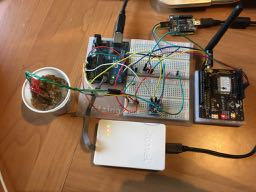
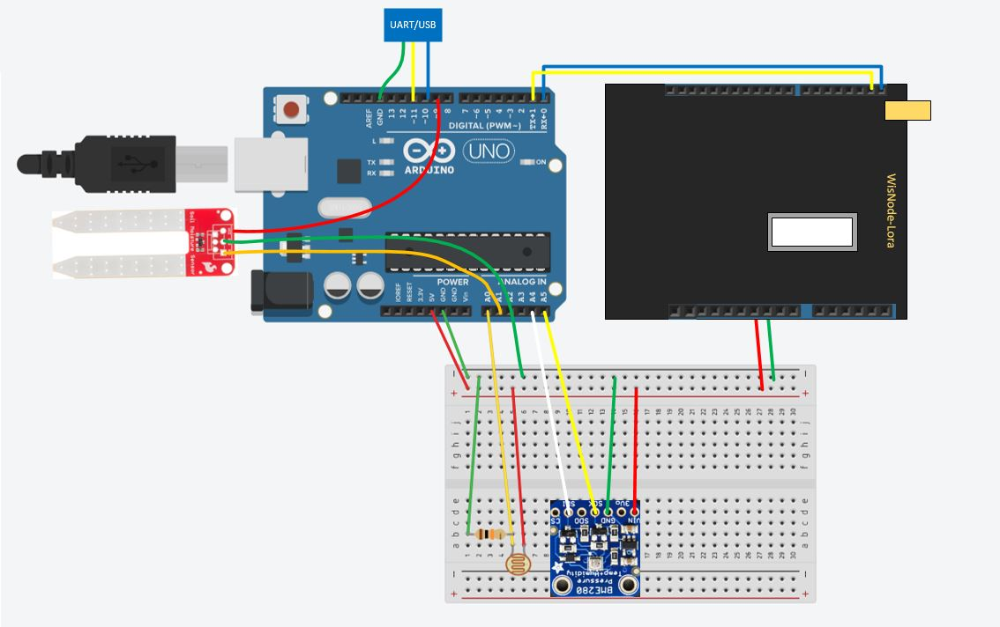
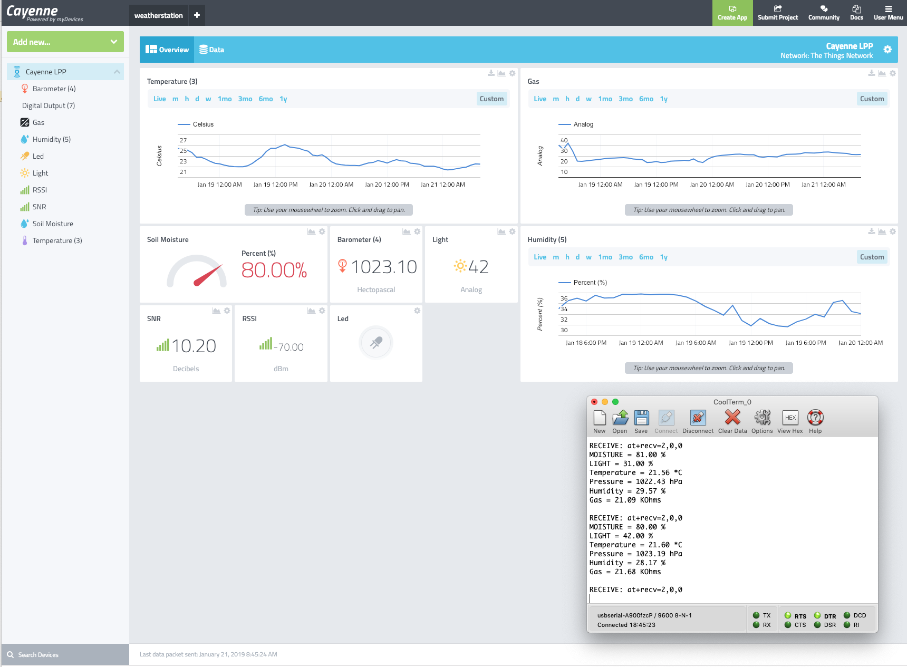

# Week 4 - Weather station

### Assignment

- Connect 3 sensors to the ExpLoRer board and read out the sensor data in the Serial Monitor of the Arduino IDE. 
- Add LoRa connectivity to the Arduino Sketch and send the sensor data every 10 minutes during a period of 48 hours. Read the data in the Developer Console. Make sure the ExpLoRer joins the network using OTAA. 
- Change the payload to a human-readable format using the Payload Formats in the developer console
- Setup a Cayenne myDevices dashboard and create graphs to visualize the sensor data over time. Add the public URL of the dashboard in the Discussion section of the course, or post a screenshot.

Recommended sensors to use:
BMP280 - Barometric Pressure Sensor
DHT 22 - Temperature and humidity sensor
MQ4 - Methane CNG Gas Sensor

You may pick other hardware.

### Hardware I used for this assignment

The recommended 
- Arduino Uno
- RAK WisNode Lora (Arduino shield with Lora chip)
- Sparkfun Soil Moisture sensor
- Adafruit BME680 sensor (temperature, atm pressure, humidity, gas)
- LDR (light intensity)


### Wiring





### Cayenne


### Note
The RAK WisNode Lora board is an arduino shield with a RAK811 module. I didn't stack it on top of the Arduino so I could plug a debugger (the white box on the photo). Similar to the Sodaq Explorer board the RAK811 aslo accepts serial communication (AT commands).
However the RAK library API requires hex string messages instead of a byte array.
The src folder contains the Arduino code.

```cpp


//#include <Arduino.h> //set this if using Atmel Studio
#include "RAK811.h"
#include <SoftwareSerial.h>
#include <stdio.h>
#include <CayenneLPP.h>
#include <Wire.h>
#include <Adafruit_Sensor.h>
#include <Adafruit_BME680.h>

#define debugTXpin 11
#define debugRXpin 10
#define LDRPin A0
#define MoisturePin A1
#define MoisturePowerPin 9

#define loraSerial Serial

#define SEALEVELPRESSURE_HPA (1013.25)

#define WORK_MODE LoRaWAN
#define JOIN_MODE OTAA
#define SEND_EVERY      60000
#define RETRIES         3
#define RETRY_AFTER     5000
#define APP_PORT        1
#define REQUIRE_ACK     0

Adafruit_BME680 bme; // I2C

typedef struct BMEReading {
	float temperature;
	float pressure;
	float humidity;
	float gas;
	bool error;
} BMEReading;


SoftwareSerial debugSerial(debugRXpin,debugTXpin);

RAK811 lora(loraSerial, debugSerial);

CayenneLPP lpp(51);

uint8_t led = 0;

bool joined = false;

// ----function declarations----

float getMoisture(int pin);
float getLight(int pin);
BMEReading getBMEReading();
void sendSensorData();
void receiveDownLinkMessage();
// ----

static unsigned long last = 0;

void setup() {

	pinMode(LED_BUILTIN, OUTPUT);
	
	pinMode(MoisturePowerPin, OUTPUT);
	digitalWrite(MoisturePowerPin, LOW);

	debugSerial.begin(9600);
	while (! debugSerial);
	
	loraSerial.begin(9600);
	while (! loraSerial);

	debugSerial.println(lora.rk_getVersion());
	debugSerial.println(lora.rk_getBand());

	lora.rk_setWorkingMode(WORK_MODE);
	lora.rk_setConfig("adr", "on");
    lora.rk_setConfig("duty", "on");
	
	
	while(loraSerial.available()){
		loraSerial.read();
	}
	

	//Note: devEUI, appEUI and AppKey have been set via manual AT commands on device
	//I couldn't get the combination lora.rk_initOTAA and bme.performReading() to work together...even when lora.rk_initOTAA
	//is in setup() and bme.performReading() is in loop()...
	if (lora.rk_joinLoRaNetwork(JOIN_MODE))
	{
		while(last < 20000){
			if(loraSerial.available()){
				String r = loraSerial.readStringUntil('\n');
				
				if(r.startsWith("at+recv=3,")){
					debugSerial.println(r);
					
					joined = true;
					break;
				}
			}
			
			last = millis();
		}
		
		if(!joined){
			debugSerial.println("could not Join");
			while(1);
		}

	}
		
	
	// Set up oversampling and filter initialization (from Adafruit sample)
	bme.setTemperatureOversampling(BME680_OS_8X);
	bme.setHumidityOversampling(BME680_OS_2X);
	bme.setPressureOversampling(BME680_OS_4X);
	bme.setIIRFilterSize(BME680_FILTER_SIZE_3);
	bme.setGasHeater(320, 150); // 320*C for 150 ms
	bme.begin();

	
	last = 0;
}

void loop()
{
	
	if ((last == 0) || (millis() - last > SEND_EVERY)) {
		last = millis();
		sendSensorData();
	}
	
	receiveDownLinkMessage();

}

void sendSensorData(){
	
	float moisture = getMoisture(MoisturePin);
	float light = getLight(LDRPin);
	BMEReading bmeReading = getBMEReading();
	
	if(joined){
		
		unsigned char tries = 0;
		
		lpp.reset();
		lpp.addRelativeHumidity(1, moisture);
		lpp.addAnalogInput(2, light);
		lpp.addTemperature(3, bmeReading.temperature);
		lpp.addBarometricPressure(4, bmeReading.pressure);
		lpp.addRelativeHumidity(5, bmeReading.humidity);
		lpp.addAnalogInput(6, bmeReading.gas);
		lpp.addDigitalOutput(7, led);
		
		while (true) {

			//RAK811 module keeps jumping back to SF12 even with a gateway
			//a few meters away...so for testing I force it to SF7 before each send
			lora.rk_setRate(5);
			
			
			//convert the lpp byte array into hex string
            //here I wished the RAK API would have a sendBytes(ack, port, byteArray) method.
			
			int size = lpp.getSize();
			
			byte * buffer = lpp.getBuffer();
			char payload[2*size + 1];
			
			int i;
			for (i=0; i<size; i++) {
				sprintf(payload+i*2, "%02x", buffer[i]);
			}
			payload[i*2] = 0;
			
			if (lora.rk_sendData(REQUIRE_ACK, APP_PORT, payload)) {
				return;
			}
			
			tries++;
			if (tries > RETRIES) break;

			debugSerial.println("Error sending data, retrying...");
			
			delay(RETRY_AFTER);
		}
	}
}

//supports turning on/off the builtiin Arduino led
void receiveDownLinkMessage(){
	
	String r = lora.rk_recvData();
	

	if (r.length()) {

		debugSerial.println("RECEIVE: " + r);
		
		if (r.startsWith("at+recv=0,")) {

			if(r.endsWith("64ff"))
			{
				led = 1;
				digitalWrite(LED_BUILTIN, HIGH);
			}
			else if(r.endsWith("00ff"))
			{
				led = 0;
				digitalWrite(LED_BUILTIN, LOW);
			}
			

		}
	}
	
}

BMEReading getBMEReading()
{
	BMEReading bmeReading;
	
	if (! bme.performReading()) {
		debugSerial.println("Failed to perform reading :(");
		bmeReading.error = true;
		return bmeReading;
	}
	
	debugSerial.print("Temperature = ");
	debugSerial.print(bme.temperature);
	debugSerial.println(" *C");

	debugSerial.print("Pressure = ");
	debugSerial.print(bme.pressure / 100.0);
	debugSerial.println(" hPa");

	debugSerial.print("Humidity = ");
	debugSerial.print(bme.humidity);
	debugSerial.println(" %");

	debugSerial.print("Gas = ");
	debugSerial.print(bme.gas_resistance / 1000.0);
	debugSerial.println(" KOhms");

	debugSerial.println();

	bmeReading.temperature = float(bme.temperature);
	bmeReading.pressure = float(bme.pressure / 100.0); 
	bmeReading.humidity = float(bme.humidity);
	bmeReading.gas = float(bme.gas_resistance / 1000.0);

	return bmeReading;
}

float getMoisture(int pin){


	digitalWrite(MoisturePowerPin, HIGH); //turn sensor on
	delay(10);
	
	float moisture = map(analogRead(MoisturePin), 0, 1023, 0.0, 100.0);
	
	digitalWrite(MoisturePowerPin, LOW);//turn the sensor off
	
	debugSerial.print("MOISTURE = ");
	debugSerial.print(moisture);
	debugSerial.println(" %");
	
	
	return moisture;

}

float getLight(int pin){


	float light = map(analogRead(LDRPin), 0, 1023, 0.0, 100.0);
	
	debugSerial.print("LIGHT = ");
	debugSerial.print(light);
	debugSerial.println(" %");
	
	return light;
}


```

### Custom formatting
There is also a version with custom data formatting instead of CayenneLPP
 in the [source](https://github.com/cziedins/lora_academy/tree/master/src) folder.

The main difference is preparing the payload to be sent ...
```cpp
char payload[21];
		
sprintf(payload, "%02X%02X%02X%02X%02X%02X%02X%02X%02X%02X",
moisture,
light,
highByte(bmeReading.temperature), lowByte(bmeReading.temperature),
highByte(bmeReading.pressure), lowByte(bmeReading.pressure),
highByte(bmeReading.humidity), lowByte(bmeReading.humidity),
highByte(bmeReading.gas), lowByte(bmeReading.gas));
```
and it's data formatter for ttn...
```js
function Decoder(bytes, port) {
    var decoded = {};
    
    decoded.moisture = bytes[0];
    decoded.light = bytes[1];
    decoded.temperature = ((bytes[2] << 8) | bytes[3]) / 100.00;
    decoded.pressure = 900 + ((bytes[4] << 8) | bytes[5]) / 100.00;
    decoded.humidity = ((bytes[6] << 8) | bytes[7]) / 100.00;
    decoded.gas = ((bytes[8] << 8) | bytes[9]) / 100.00;
    decoded.trigger = decoded.temperature > 25.00;
    
    return decoded;
  }
```

### References

- [RAK WisNode Lora (RAK811 module)](https://www.hackster.io/naresh-krish/getting-started-with-the-rak811-lora-node-67f157)

- [RAK811 with Arduino](https://www.hackster.io/naresh-krish/using-the-rak811-lora-module-with-arduino-a38de8)
- [Arduino and photocell](https://learn.adafruit.com/photocells/using-a-photocell)
- [Adafruit BME680](https://learn.adafruit.com/adafruit-bme680-humidity-temperature-barometic-pressure-voc-gas)
- [Sparkfun soil moisture sensor](https://learn.sparkfun.com/tutorials/soil-moisture-sensor-hookup-guide?_ga=2.237904832.1504068775.1547469604-291296060.1544871953)
- [RAK811 - receiving downlink messages](https://github.com/xoseperez/wisnode-lora-downlink/blob/master/lib/RAK811/RAK811.cpp)


